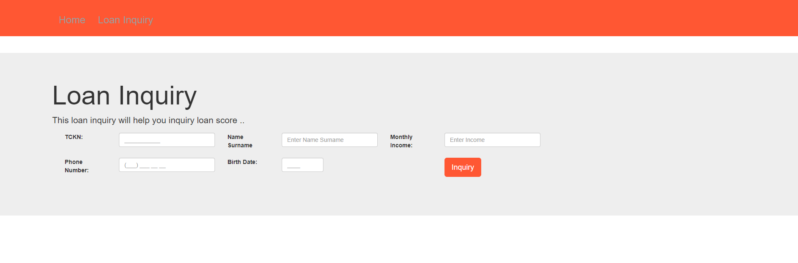
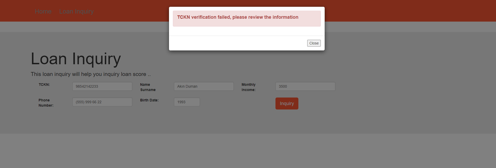
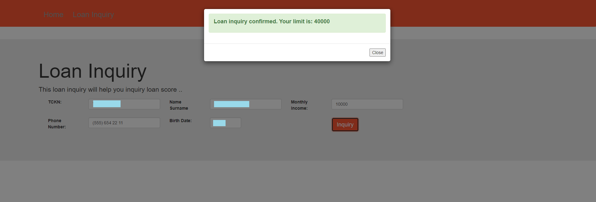
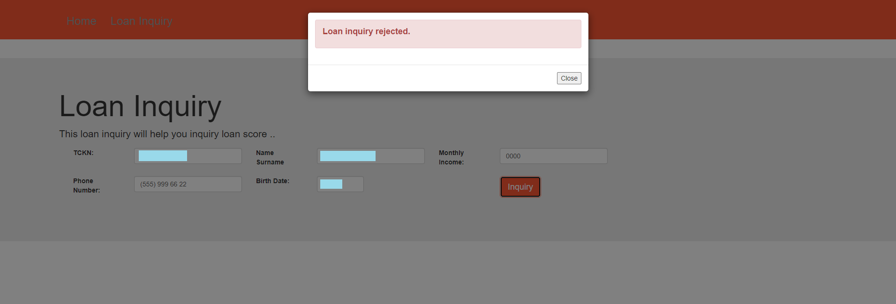

# loan-inquiry

### Summary
- For a loan application system, the service that receives loan application requests and returns the loan result to the customer according to the relevant criteria,
- Rejection or approval responses can be returned to the user. If the response is approval, the loan rate is determined,
- Creating a Restful endpoint using spring boot,
- Making necessary front-end designs,
- Saving the results to the db, encrypting some fields and querying from NVI for user authentication.

### Introduction
Loan Inquiry application made with Spring Boot(JPA) and AngularJS

### Usage
1. Clone the project
2. Eclipse: File -> Import -> Maven -> Existing Maven Projects
3. Maven Update
4. Set DB connections in properties file 
5. Run
6. Navigate to [http://localhost:8090](http://localhost:8090) 

### Architecture
> VIEW - CONTROLLER - SERVICE - REPOSITORY - DOMAIN - DATABASE

### Patterns
> SINGLETON PATTERN - STRATEGY PATTERN

### APIs
- /loanInquiry : It is a post requests. Customers use this service inquiry for loan then service save customer informations to db. 

### Running the tests
You should import JUnit 4 library to eclipse for tests. For tests ➡️ src/test/java

### Technologies
- Java 1.8
- AngularJS
- JavaScript
- Bootstrap

### Settings in application.properties
- limitFactor: Inquiry limit factor
- sms.queueCapacity: Sending sms queue capacity 
- threadCount: Thread count while sending sms in multithread

### Screenshots
- Inquiry Screen

- Invalid Credentials

- If loan confirmed

- If loan rejected

